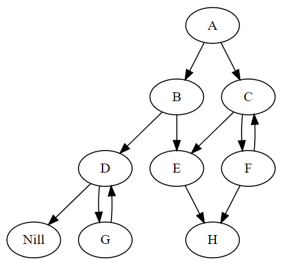
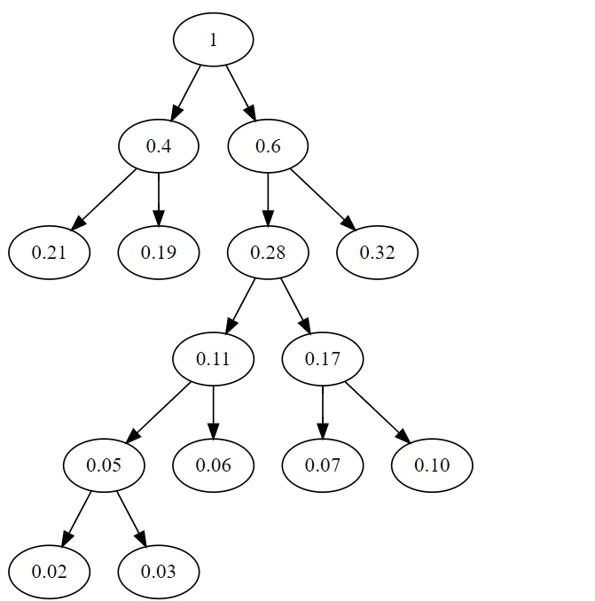
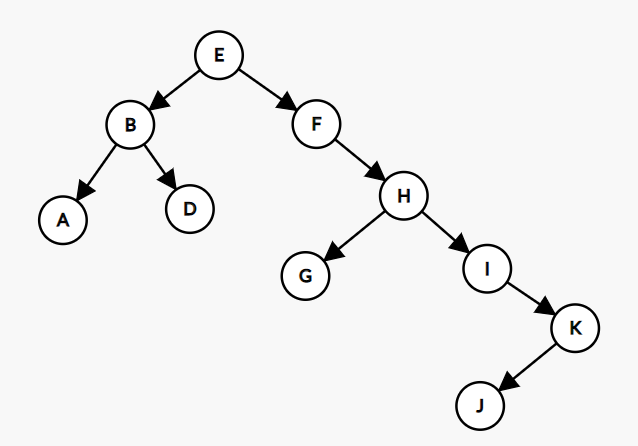
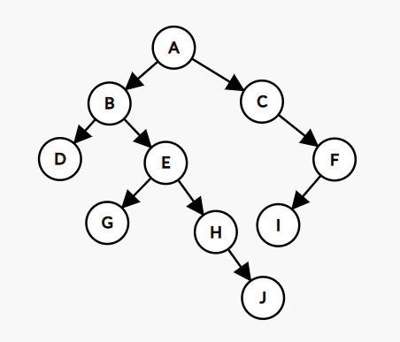

# <center> 树与二叉树作业 </center>
#### <p align="Right"> 登峰1901 张皓鸿 </p>
### 6.8
###### 总结点数减去叶子节点数为非叶子节点数<br>kn1+1-n0=n1<br>移项得<br>n0=(k-1)n1+1
### 6.15<br>
### 6.16
|index | 1 | 2 | 3 | 4 | 5 | 6 | 7 | 8 | 9 | 10 | 11 | 12 | 13 | 14 |
|----- |---|---|---|---|---|---|---|---|---|----|----|----|----|----|
|Info  |A|B|C|D|E|F|G|H|I|J|K|L|M|N|
|Ltag  |0|0|0|1|0|1|0|1|0|0|1|1|1|1|
|Lchild|2|4|6|2|7|3|10|14|12|13|13|9|10|11|
|Rtag  |0|0|1|1|0|0|0|1|1|1|0|1|1|1|
|Rchild|3|5|6|5|8|9|11|3|12|13|14|0|11|8|

### 6.26
###### 哈夫曼编码为<br><br>
取向左为0，向右为1<br>00, 01, 11, 10000, 10001, 1001, 1010, 1011<br>相对于树的表示，不如树直观，无法定量反应距离权重，但更节省空间。
### 6.27

### 6.29

### 6.43
```
Status mirror_tree(bitree root){      //镜像二叉树
    if(!root)return 0;
    node *p = root->rchild;
    root->rchild = root->lchild;
    root->lchild = p;
    mirror_tree(root->lchild);
    mirror_tree(root->rchild);
}
```

### 6.44
```
Status find_x( bitree root, char x, bitree &tmp){       //找到x节点
    if(!root)return ERROR;
    if(root->data == x){
        tmp = root;
        return OK;
    }
    else{
        if(find_x(root->lchild, x, tmp))return OK;
        else if(find_x(root->rchild, x, tmp))return OK;
    }
}

int tree_height(bitree root){     //求二叉树高度

    if(!root)return 0;
    if(root && !root->lchild && !root->rchild)return 1;
    if(tree_height(root->lchild) >= tree_height(root->rchild))
    return tree_height(root->lchild)+1;
    else return tree_height(root->rchild)+1;
}
```
### 6.45
