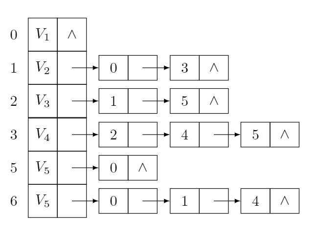
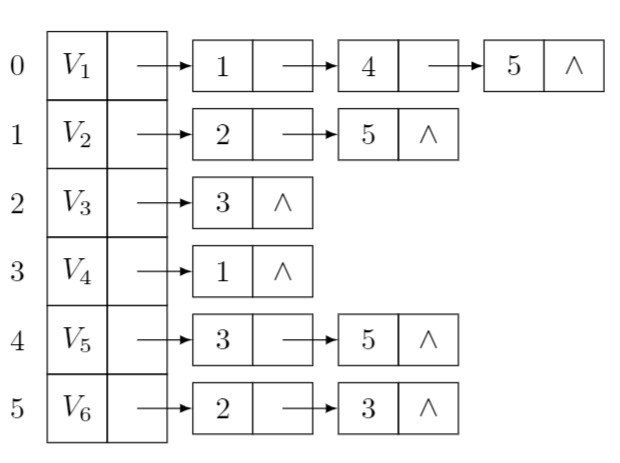
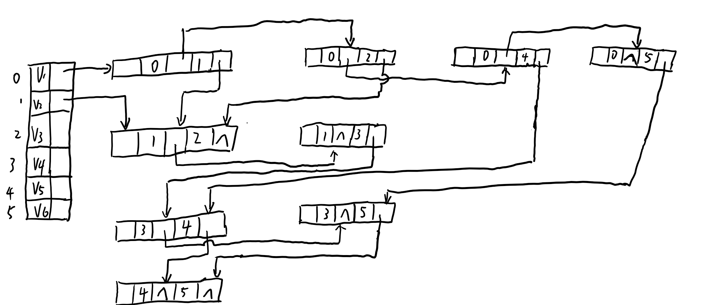
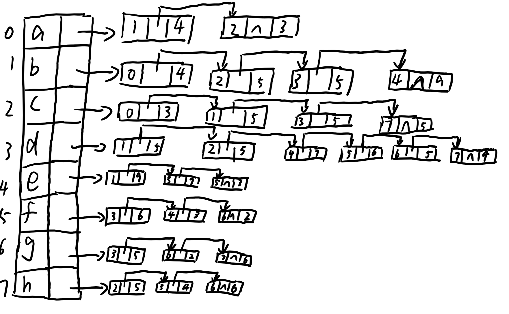
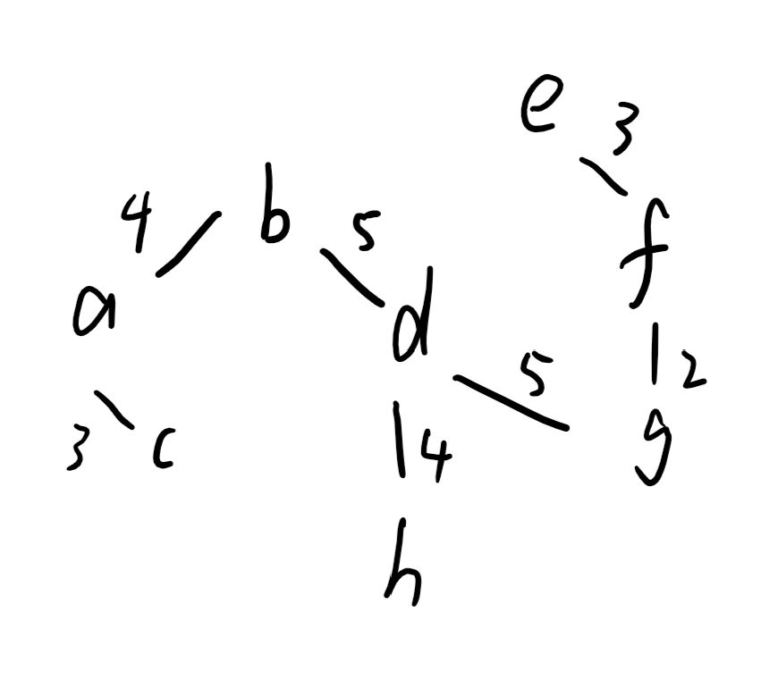

# <center> 图作业 </center>
#### <p align="Right"> 登峰1901 张皓鸿 </p>
#### 7.1

|顶点编号|1|2|3|4|5|6|
|------|---|---|---|---|---|---|
|入度|3|2|1|1|2|2|2|
|出度|0|2|2|3|1|3


邻接矩阵如下
$$
\begin{array}{c|cc}
    & 1 & 2 & 3 & 4 & 5 & 6 \\ \hline
  1 & \infty & \infty & \infty & \infty & \infty & \infty \\
  2 & 1 & \infty & \infty & 1 & \infty & \infty \\
  3 & \infty & 1 & \infty & \infty & \infty & 1 \\
  4 & \infty & \infty & 1 & \infty & 1 & 1 \\
  5 & 1 & \infty & \infty & \infty & \infty & \infty \\
  6 & 1 & 1 & \infty & \infty & 1 & \infty \\
\end{array}
$$

邻接表如下



逆邻接表如下



强连通分量为{2，3，4，6}，{1}，{5}

#### 7.3
邻接多重表如下


* 深度优先遍历
    * 顶点序列：$V_1,V_2,V_3,V_4,V_5,V_6$  
    * 边序列：$(V_1,V_2),(V_2,V_3),(V_3,V_4),(V_4,V_5),(V_5,V_6)$
* 广度优先遍历
    * 顶点序列：$V_1,V_2,V_3,V_5,V_6,V_4$
    * 边序列：$(V_1,V_2),(V_1,V_3),(V_1,V_5),(V_1,V_6),(V_2,V_4)$

#### 7.7
* 邻接矩阵如下
$$
\begin{array}{c|cc}
    & a & b & c & d & e & f & g & h \\ \hline
  a & \infty & 4 & 3 & \infty & \infty & \infty & \infty & \infty \\
  b & 4 & \infty & 5 & 5 & 9 & \infty & \infty & \infty\\
  c & 3 & 5 & \infty & 5 & \infty & \infty & \infty & \infty \\
  d & \infty & 5 & 5 & \infty & 7 & 6 & 5 & 4 \\
  e & \infty & 9 & \infty & 7 & \infty & 3 & \infty & \infty \\
  f & \infty & \infty & \infty & 6 & 3 & \infty & 2 & \infty \\
  g & \infty & \infty & \infty & 5 & \infty & 2 & \infty & 6 \\
  h & \infty & \infty & \infty & 4 & \infty & \infty & 6 & \infty \\
\end{array}
$$

* 邻接表如下

* 最小生成树如下


#### 7.10

|顶点|ve|vl|弧|e|l|
|---|---|---|---|---|---|
|a|0|0|a-A|0|19|
|A|1|20|a-B|0|18|
|B|6|24|a-D|0|16|
|C|17|26|a-F|0|4|
|D|3|19|a-G|0|0|
|E|34|34|a-I|0|6|
|F|4|8|A-C|1|20|
|G|3|3|B-C|6|24|
|H|13|13|D-C|3|19|
|I|1|7|D-E|3|26|
|J|31|31|D-J|3|25|
|K|22|22|F-E|4|23|
|ω|44|44|F-H|4|8|
||||G-ω|3|23|
||||G-H|3|3|
||||I-H|1|7|
||||C-E|17|26|
||||H-C|13|22|
||||H-J|13|27|
||||H-K|13|13|
||||K-J|22|22|
||||J-E|31|31|
||||E-ω|34|34|
||||J-ω|31|32|

关键路径为：a->G->H->K->J->E->ω
#### 7.11
|节点序号|a|b|c|d|e|f|g|
|-------|---|---|---|---|---|---|---|
|1|$\infty$|15|**2**|12|$\infty$|$\infty$|$\infty$|
|2|$\infty$|15|$\infty$|12|10|**6**|$\infty$|
|3|$\infty$|15|$\infty$|11|**10**|$\infty$|16|
|4|$\infty$|15|$\infty$|**11**|$\infty$|$\infty$|16|
|5|$\infty$|15|$\infty$|$\infty$|$\infty$|$\infty$|**14**|
|6|$\infty$|**15**|$\infty$|$\infty$|$\infty$|$\infty$|$\infty$|

#### 7.22
```
void DFS(ALGraph G, int i, int j, Status visited[], Status &found)
{
	ArcNode *p;
	visited[i] = TRUE;
	if (i == j)
		found = TRUE;
	else
	{
		p = G.vertices[i].firstarc;
		while(!found && p != NULL)
		{
			if(!visited[p->adjvex])
				DFS(G, p->adjvex, j, visited, found);
			p = p->nextarc;
		}
	}
}

Status Path(ALGraph G, int i, int j)
{
	int m;
	Status visited[MAX_VERTEX_NUM];
	Status found;
	for(m = 1; m <= G.vexnum; m++)
		visited[m] = FALSE;
	found = FALSE;
	DFS(G, i, j, visited, found);
	return found;
}
```
#### 7.42
```
int locate(AGraph *G,VexType vex){
	int i;
	for(i=0;i<G->vexnum;i++){
		if(G->vertices[i].data==vex)
			return i;
	}
	return -1;
}

AGraph *creat()
{
    AGraph *G=(AGraph*)malloc(sizeof(AGraph));
    printf("请输入顶点数目：");
    scanf("%d", &(G->vexnum));
    printf("请输入弧的数目：");
    scanf("%d", &(G->arcnum));
     
    int i,k;
    VexType vex;
    VexType v1, v2,info;
    printf("请输入顶点信息：\n");
    for (i = 0; i < G->vexnum; i++)
    {
        scanf("%d", &vex);
        G->vertices[i].data = vex;
        G->vertices[i].firstarc = NULL;
    }
    
    printf("请输入弧的信息：\n");
    for (k = 0; k < G->arcnum; k++)
    {
    	scanf("%d%d%d", &v1, &v2,&info);  
        int a = locate(G, v1);      
        int b = locate(G, v2);      
    
        ArcNode *p = (ArcNode*)malloc(sizeof(ArcNode));
        p->adjvex = b;p->info=info;
        p->nextarc = G->vertices[a].firstarc;
        G->vertices[a].firstarc = p;
    }
    return G;
}

int sortP(int dist[],int n,int set[]){
	int k=0,min,i;
	while(set[k]==1) k++;
	min=dist[k];
	for(i=k+1;i<n;i++){
		if(set[i]==0&&dist[i]<min){
			k=i;min=dist[i];
		}
	}
	return k;
}

void ShortestPath(AGraph *G,int v0){
	int n=G->vexnum;
	int dist[n],path[n],set[n];
	ArcNode *p;
	int vl=locate(G,v0),i;
	for(i=0;i<n;i++){
		dist[i]=INFINITY;
		path[i]=-1;
		set[i]=0;
	}
	for(p=G->vertices[vl].firstarc;p;p=p->nextarc){
		dist[p->adjvex]=p->info;
		path[p->adjvex]=vl;
	}
	set[vl]=1;
	int k,min,m;
	for(i=0;i<n-1;i++){
		min=sortP(dist,n,set);
		set[min]=1;
		
		for(p=G->vertices[min].firstarc;p;p=p->nextarc){
			m=p->adjvex;
			if(set[m]==0&&dist[m]>dist[min]+p->info){
				dist[m]=dist[min]+p->info;
				path[m]=min;
			}
		}
	}
	
	for(i=0;i<n;i++){
		printf("%d %d %d\n",set[i],dist[i],path[i]);
	}
} 


int main(){
	AGraph *G=creat();
	ShortestPath(G,0);
	return 0;
}

```
